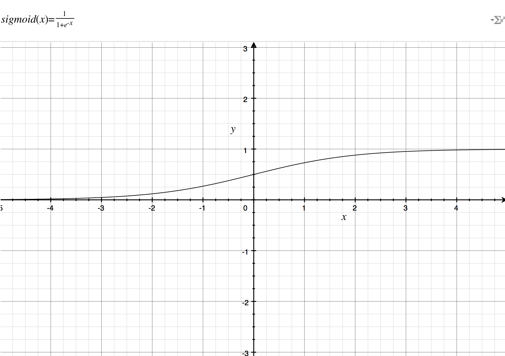
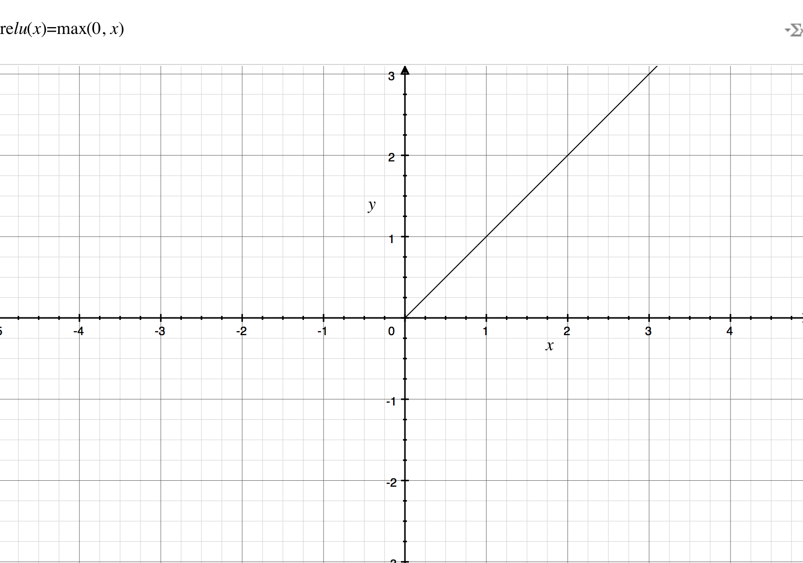

# 深度学习概述

[TOC]

## 1.2 什么是神经网络？ 

深度学习就是更复杂的神经网络。

## 1.3 用神经网络进行监督学习

目前为止，由神经网络模型创造的价值基本上都是基于监督学习（Supervised Learning）的。

监督学习与非监督学习的本质区别就是**是否已知训练样本的输出**。

在实际应用中，机器学习解决的大部分问题都属于监督学习，神经网络模型也大都属于监督学习。

根据不同的问题和应用场合，应该使用不同类型的神经网络模型。对于一般的监督学习（如房价预测和线上广告），我们只要使用标准的神经网络模型就可以了。而对于图像识别处理问题，我们则要使用卷积神经网络（Convolution Neural Network），即CNN。而对于处理类似语音这样的序列信号时，则要使用循环神经网络（Recurrent Neural Network），即RNN。还有其它的（例如自动驾驶）复杂问题则需要更加复杂的混合神经网络模型。

Standard NN，Convolutional NN和Recurrent NN的神经网络结构图：

机器学习的数据分为：**结构化数据与非结构化数据**。结构化数据通常具有实际的物理意义，比较容易理解。非结构化数据通常指比较抽象的数据，包括：音频、图片、文本等。

## 1.4 为什么深度学习会兴起？

传统机器学习算法在数据量较大的时候，性能一般，很难再有提升。然而，深度学习模型由于网络复杂，对大数据的处理和分析非常有效。所以，近些年来，在处理海量数据和建立复杂准确的学习模型方面，深度学习有着非常不错的表现。然而，在数据量不大的时候，例如上图中左边区域，深度学习模型不一定优于传统机器学习算法，性能差异可能并不大。

深度学习如此强大的原因归结为三个因素：**数据、计算、算法**

1. 大数据时代，数据量的几何级数增加。

2. 计算机硬件技术的发展，计算成本下降，速度提高。

3. 算法上的创新和改进，让深度学习的性能和速度也大大提升。

   举个算法改进的例子，之前神经网络神经元的激活函数是Sigmoid函数，后来改成了ReLU函数。原因是对于Sigmoid函数，在远离零点的位置，函数曲线非常平缓，其梯度趋于0，所以造成神经网络模型学习速度变得很慢。然而，ReLU函数在x大于零的区域，其梯度始终为1，尽管在x小于零的区域梯度为0，但是在实际应用中采用ReLU函数确实要比Sigmoid函数快很多。

------

$$
sigmoid\left( x \right)=\frac{1}{1+e^{-x}}
$$

$$
\mbox{re}lu\left( x \right)=\max \left( 0,\; x \right)
$$
